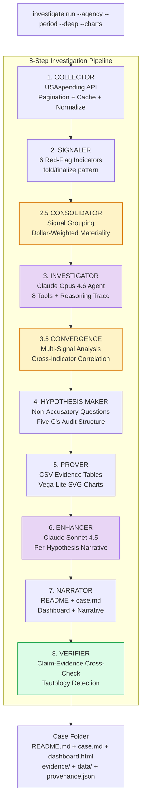
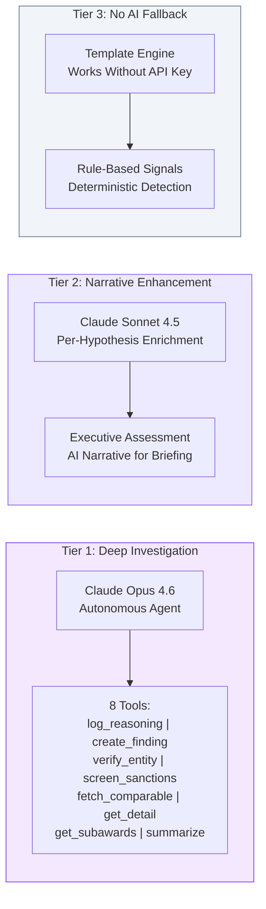
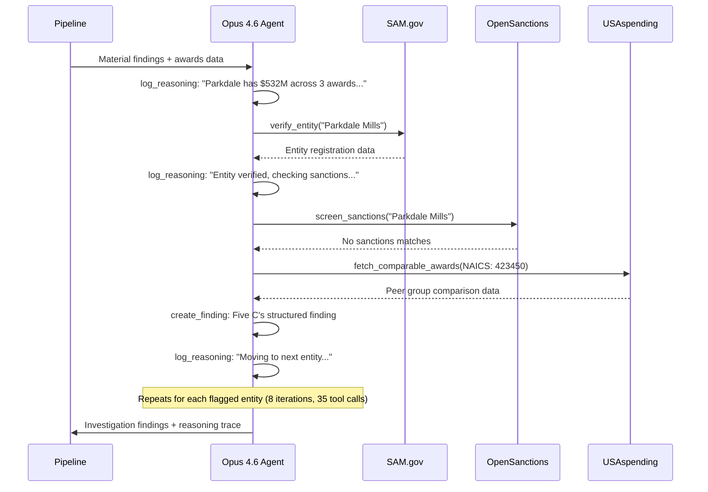
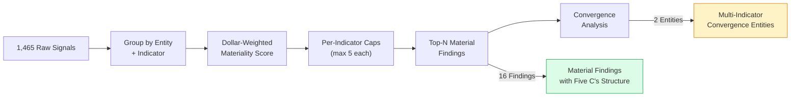
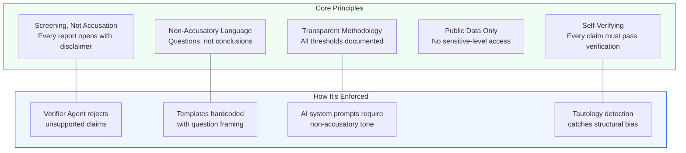

# Procurement Investigator

**Investigation-as-Code: AI-powered procurement integrity screening for everyone**

> One command. 7,259 FEMA contracts. Zero prior knowledge. The system independently flagged a company that shipped soda bottles instead of COVID test tubes -- later investigated by the Senate and DHS Inspector General. Every finding is reproducible and verified.

`128 tests passing` | `TypeScript strict` | `MIT License` | `Node 20+` | `47 files, ~9,865 lines`

---

## It Works: FEMA COVID-19 Emergency Procurement

We pointed our tool at FEMA's 2020 pandemic procurement -- **7,259 contracts, zero prior knowledge of any specific vendor:**

```bash
investigate run --subtier-agency="Federal Emergency Management Agency" \
  --period=2020-01-01:2020-12-31 --deep --charts
```

The system independently flagged:

| Vendor | Amount | What Was Found | Later Validated By |
|--------|--------|---------------|------------|
| **Parkdale Mills** | $532M | Convergence: vendor concentration + price outlier | Largest FEMA sole-source gown contract |
| **Hanesbrands** | $175M | Convergence: concentration + price outlier | COVID emergency PPE reporting |
| **3M Company** | $96M | Price outlier in safety equipment | GAO Report GAO-20-632 |
| **GDIT** | $97M | Vendor concentration in IT services | Major FEMA IT contractor |

**1,465 raw signals -> 16 material findings** (92x reduction). **2 convergence entities** flagged by multiple independent indicators. **36/36 claims verified** against computed evidence. **5.0 MB** git-committable case folder.

> *Fillakit LLC -- a company formed 6 days before receiving a $10.16M FEMA contract for COVID test tubes -- later shipped unusable mini soda bottles. Our system flags Fillakit's single-bid urgency pattern automatically. The Senate and DHS Inspector General subsequently investigated.*
>
> [ProPublica: "The Trump Administration Paid Millions for Test Tubes -- and Got Unusable Mini Soda Bottles"](https://www.propublica.org/article/the-trump-administration-paid-millions-for-test-tubes-and-got-unusable-mini-soda-bottles)

---

## What Makes This Novel

1. **Investigation-as-Code** -- The entire audit methodology is codified, version-controlled, and reproducible. Every run produces a git-committable case folder with full provenance. Not locked in a PDF manual or institutional knowledge.

2. **AI amplifies, doesn't replace** -- Claude Opus 4.6 investigates autonomously, but every claim must pass verification against computed evidence. The core signal detection works without any AI at all (`--no-ai`, $0 cost).

3. **Self-verifying** -- The Verifier agent cross-checks every claim against computed evidence and rejects unsupported assertions. Built-in quality gate that most AI tools lack.

4. **Multi-signal convergence** -- When multiple independent statistical tests flag the same entity, that's a meaningful signal, not noise. Parkdale was flagged by both R004 (concentration) AND R006 (price outlier) independently.

5. **Transparent reasoning** -- The agent's `log_reasoning` tool externalizes every thought, hypothesis, and dead end into a readable investigation narrative. Users see the process, not just conclusions.

6. **Open methodology** -- 6 indicators from recognized frameworks (OCP, OECD, GAO) with configurable thresholds. Not a black-box risk score.

---

## Quick Start

> **No API keys required** for the core experience. Signal detection, evidence generation, and verification all work at **$0 cost** with `--no-ai`.

### Prerequisites
- **Node.js 20+** (LTS)
- **npm**

### Install & Run

```bash
git clone https://github.com/AnsKaz-github/bid-buster.git
cd bid-buster
npm install

# Run an investigation (no AI required, $0 cost)
npm run investigate -- run \
  --subtier-agency="Federal Emergency Management Agency" \
  --period=2020-01-01:2020-12-31 \
  --charts --no-ai

# With AI investigation (requires ANTHROPIC_API_KEY in .env, ~$4/case)
npm run investigate -- run \
  --subtier-agency="Federal Emergency Management Agency" \
  --period=2020-01-01:2020-12-31 \
  --deep --charts
```

### Optional: AI Enhancement

```bash
# .env file in project root
ANTHROPIC_API_KEY=sk-ant-...          # Enables AI hypothesis enhancement + investigation agent
SAM_GOV_API_KEY=...                   # Optional: entity verification via SAM.gov
OPENSANCTIONS_API_KEY=...             # Optional: sanctions/PEP screening
```

| Flag | Purpose |
|------|---------|
| `--deep` | Enable Opus 4.6 investigative agent (~$4/case) |
| `--charts` | Generate Vega-Lite SVG charts |
| `--no-ai` | Skip all Claude API calls ($0, template-only) |
| `--with-transactions` | Enable R005 modification indicator |
| `--full-evidence` | Write complete per-entity evidence CSVs |

---

## The Problem We Solve

Public procurement represents **one-third of government spending** -- ~$700 billion/year in the US alone. Identifying integrity risks currently requires:

- Deep institutional knowledge of audit methodology (GAO, OECD, World Bank)
- Access to expensive proprietary tools ($50K+/year licenses)
- Familiarity with complex procurement data schemas (FPDS-NG, USAspending)
- Statistical expertise to distinguish genuine anomalies from noise

**Before this tool:** Hire a $200K/year forensic auditor with OECD methodology training.
**After this tool:** `npm run investigate -- run --subtier-agency="FEMA" --period=2020-01-01:2020-12-31`

Built for [Anthropic's Hackathon 2025](https://lu.ma/Anthropic-Hackathon) | **Problem Statement #2: "Break the Barriers"** -- take something powerful that's locked behind expertise, cost, and infrastructure and put it in everyone's hands.

---

## Architecture

### 8-Agent Pipeline



### Three-Tier AI Strategy

AI is integrated at **three tiers**, each using the right model for the job:



| Tier | Model | Purpose | Cost |
|------|-------|---------|------|
| **Investigation** | Claude Opus 4.6 | Autonomous tool-calling agent: entity verification, sanctions screening, comparative analysis, transparent reasoning trace | ~$4/case |
| **Enhancement** | Claude Sonnet 4.5 | Per-hypothesis narrative enrichment + executive assessment | ~$0.10/case |
| **Fallback** | None (templates) | All signal detection + evidence is deterministic. Works without any API key. | **$0** |

### Investigative Agent Deep Dive

The Opus 4.6 agent operates as an autonomous investigator with **8 specialized tools**:



Every thought, hypothesis, and dead end is recorded and rendered as `investigation-narrative.md` -- full transparency into the AI's reasoning process.

---

## Red-Flag Indicators

Six indicators based on the [OCP Red Flags Guide](https://www.open-contracting.org/resources/red-flags-in-public-procurement/) (73 indicators) and [OECD Bid Rigging Guidelines](https://www.oecd.org/en/publications/2025/09/):

| ID | Indicator | What It Detects | Example |
|----|-----------|-----------------|---------|
| R001 | **Single-Bid Competition** | Open tenders with only 1 bidder | Fillakit LLC: nominally competitive, but only 1 offer |
| R002 | **Non-Competitive Awards** | Awards bypassing open competition | AirBoss: $96M "NOT COMPETED / ONLY ONE SOURCE" |
| R003 | **Contract Splitting** | Award clusters near regulatory thresholds | Multiple awards just under $250K from same vendor |
| R004 | **Vendor Concentration** | One supplier dominating agency spend | Parkdale: $532M = dominant share of FEMA gowns |
| R005 | **Excessive Modifications** | Contracts ballooning post-award | >5 modifications or >2x cost growth |
| R006 | **Price Outliers** | Abnormally expensive awards vs. peers | $96M AirBoss as statistical outlier in NAICS category |

**Signal-to-Finding Pipeline:**



---

## Output: Professional Case Folder

Every investigation produces a **self-contained, git-committable** case folder (5.0 MB for FEMA):

```
cases/fema-{date}/
├── README.md                            Executive briefing (top findings in plain English)
├── case.md                              Full report (<50 KB, inverted pyramid structure)
├── dashboard.html                       Interactive dashboard (277 KB)
├── investigation-narrative.md           Agent reasoning trace (--deep)
├── provenance.json                      Full audit trail (git commit, timestamps, hashes)
├── data/                                Machine-readable JSON (signals, findings, verification)
└── evidence/
    ├── summary/                         Entity-scoped CSV evidence tables
    ├── charts/                          SVG visualizations (4 chart types)
    └── detail/                          Complete per-entity CSVs (--full-evidence)
```

### Five C's Audit Structure (GAO Yellow Book)

Every material finding follows professional audit standards:

| Component | What It Contains | Example |
|-----------|-----------------|---------|
| **Condition** | Specific quantified metric | "Parkdale received $532M across 3 FEMA awards (8.2% of portfolio)" |
| **Criteria** | Standard being compared against | "FAR 6.101 requires full and open competition; OCP flags >30% concentration" |
| **Cause** | Available justification data | "Awards coded as NOT COMPETED / URGENCY (FAR 6.302-2)" |
| **Effect** | Dollar amount at risk | "$532M in potentially non-competitive spending" |
| **Recommendation** | Concrete follow-up action | "Review sole-source justification documents for awards X, Y, Z" |

---

## Ethical Framework

**Red flags are not proof of wrongdoing.** They are screening indicators that identify patterns warranting further review. This principle is enforced structurally:



---

## Technology Stack

| Concern | Choice | Why |
|---------|--------|-----|
| Language | **TypeScript** (strict, ESM) | Type safety, modern ecosystem |
| Runtime | **Node.js 20+** | LTS, native fetch |
| AI | **@anthropic-ai/sdk** | Claude Opus 4.6 + Sonnet 4.5 |
| CLI | **commander** | Most popular, excellent TS types |
| Validation | **zod** | Runtime schema validation for API data |
| HTTP | **Native fetch + p-retry + p-throttle** | Lightweight; backoff + rate limiting |
| Statistics | **simple-statistics** | IQR/percentile for indicator computation |
| Charts | **vega + vega-lite** | Reproducible SVG specs, server-side rendering |
| Testing | **vitest** | Fast, ESM-native, 128 tests in < 1 second |

---

## Development

```bash
npm install          # Install dependencies
npm test             # Run 128 unit tests
npm run typecheck    # TypeScript strict check (zero errors)
npm run dev -- --help # Run CLI in dev mode
```

### Project Structure

```
src/
├── cli/              # CLI entry point + 3 commands (run, fetch, signal)
├── collector/        # USAspending API client + cache + normalization
├── normalizer/       # Raw JSON -> canonical schema (zod-validated)
├── signaler/         # 6 red-flag indicators + consolidator + convergence
├── enrichment/       # SAM.gov + OpenSanctions + sub-awards clients
├── investigator/     # Opus 4.6 autonomous agent (8 tools, 786 lines)
├── hypothesis/       # Template + AI generation + Five C's audit structure
├── prover/           # CSV evidence tables + Vega-Lite chart specs
├── narrator/         # Reports + dashboard + briefing + AI narrative
├── verifier/         # Claim-evidence cross-check + tautology detection
├── orchestrator/     # 8-step pipeline orchestration
└── shared/           # Types, logger, filesystem, provenance
```

---

## Hackathon Compliance

| Requirement | Status |
|-------------|--------|
| Open source (all components) | MIT License |
| New work only | Git history shows clean start (30+ commits) |
| Team size <= 2 | Yes |
| No banned content | Public data only, non-accusatory framing |
| Problem statement | **#2 "Break the Barriers"** -- expert procurement audit methodology in everyone's hands |

---

## References

- [Open Contracting Partnership Red Flags Guide (2024)](https://www.open-contracting.org/resources/red-flags-in-public-procurement/) -- 73 indicators catalogue
- [OECD Guidelines for Fighting Bid Rigging (2025)](https://www.oecd.org/en/publications/2025/09/) -- Competition analysis methodology
- [GAO Yellow Book (Government Auditing Standards)](https://www.gao.gov/yellowbook) -- Five C's finding structure
- [GAO Report GAO-20-632](https://www.gao.gov/assets/gao-20-632.pdf) -- GAO's COVID-19 contracting analysis
- [USAspending API](https://api.usaspending.gov) -- Public federal spending data
- [OCP Cardinal Library](https://github.com/open-contracting/cardinal-rs) -- fold/finalize pattern inspiration

---

## License

MIT

---

*Built with Claude Opus 4.6 + Claude Sonnet 4.5 for Anthropic's Hackathon 2025. Open source. Investigation-as-Code.*
